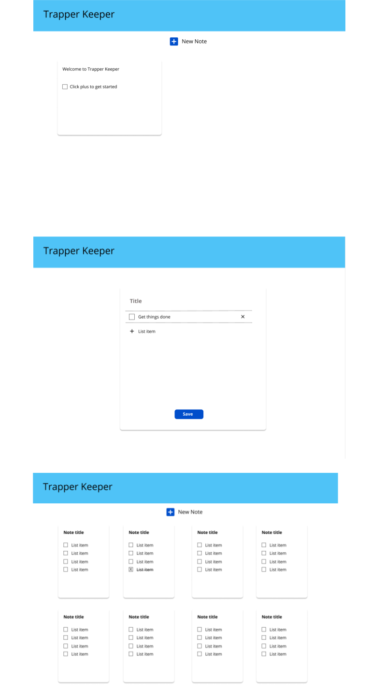

# Keeper
Keeper is an application to help users track the projects they are working on to stay on task and accomplish their goals. Keeper is modled after Google Keep. Users can save notes about multiple projects, add lists of items they need to do in order to complete a project, check them off as they go and edit or delete any part of a note.

### Set-Up:   
#### Front-end  
Clone this repo  
Run `npm install` from the root directory  
Run `npm start` and visit localhost:3000 in your browser  

#### Back-end
(Associated backend repo can be found [here](https://github.com/dForDeveloper/trapper-keeper-api))  
Run `git clone git@github.com:dForDeveloper/trapper-keeper-api.git`  
Run `npm install` from the root directory  
Run `npm start` and visit localhost:3001 in your browser  

### Preview:
  
### Primary Technologies Used:
* React 
* Redux
* React Router
* Node.js
* Express
* JavaScript
* SCSS

### Testing:
Jest and Enzyme for front-end and back-end testing  
Run `npm test` from the associated root directory  

### Original Assignment: 
[Trapper Kepper](http://frontend.turing.io/projects/trapper-keeper.html) project from Turing School of Software & Design

### Contributors
[Jeo D](https://github.com/dForDeveloper)  
[Tiffany Bachmann](https://github.com/trbachmann)  
[Whitney Burton](https://github.com/whitneyburton)  

### Wireframes:

This project was bootstrapped with [Create React App](https://github.com/facebook/create-react-app).